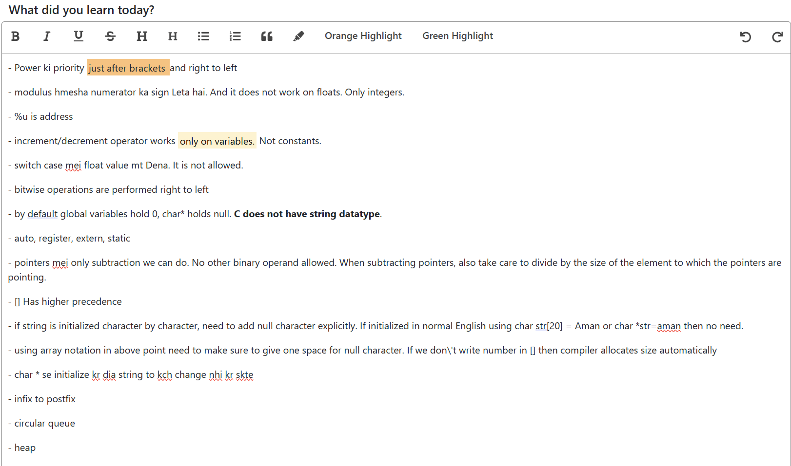
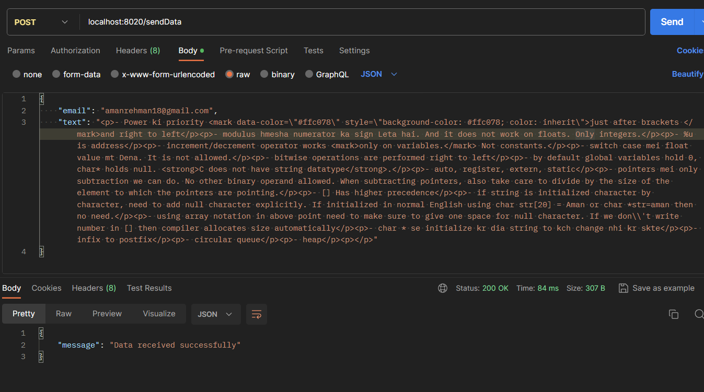
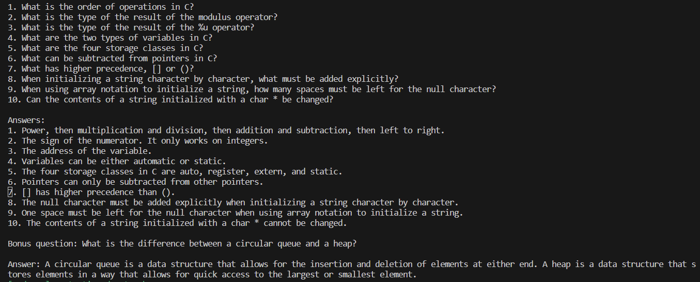
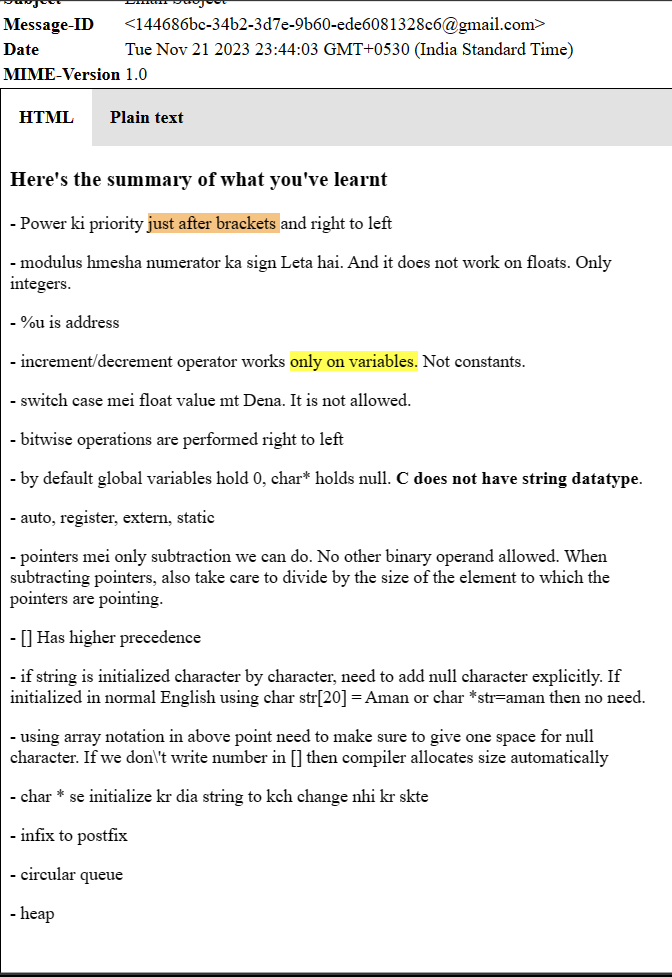
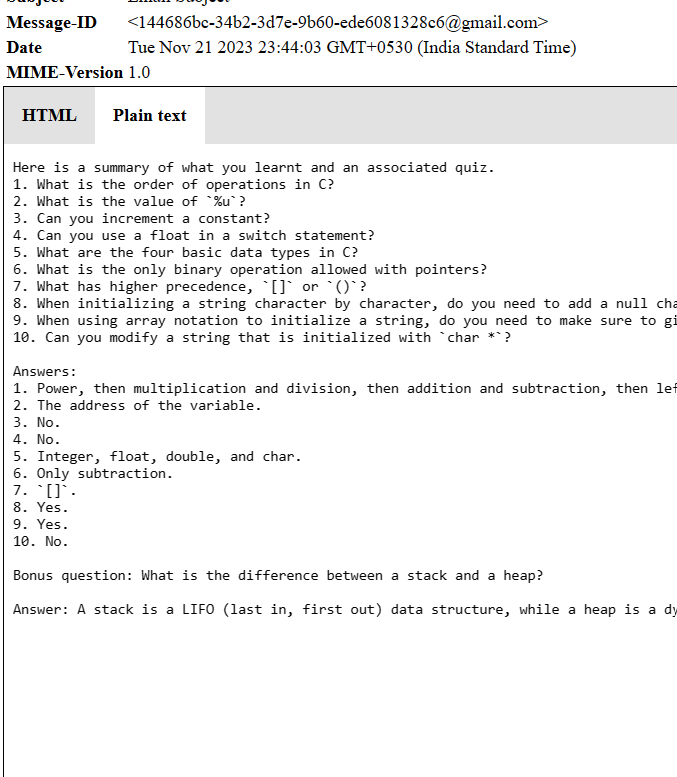
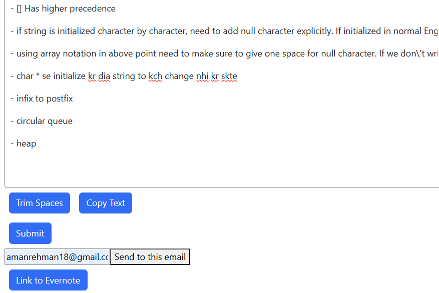
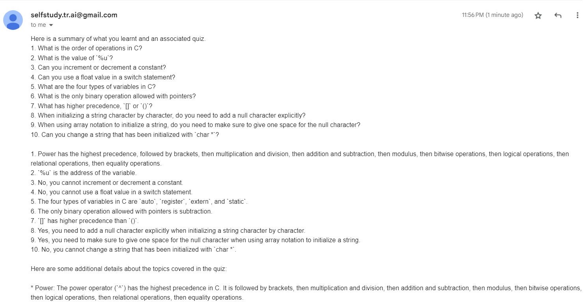
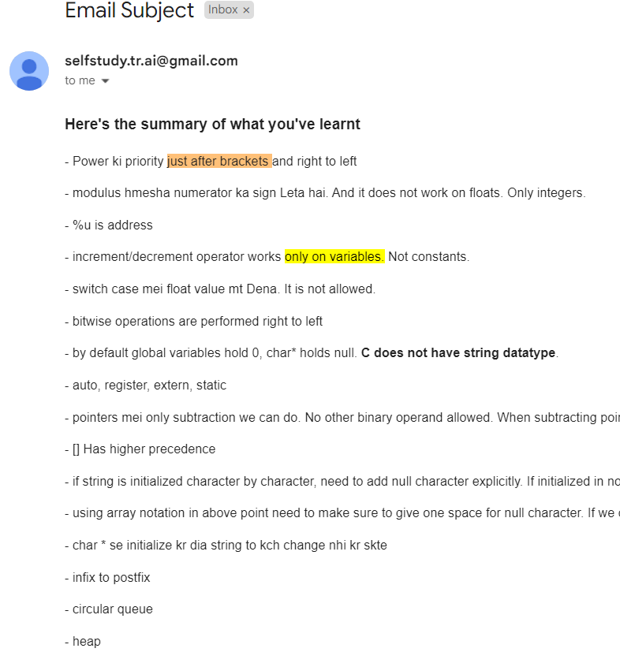

# SelfStudy.tr.ai
Flexibility. Customizability. Learn your own way.

Make notes about what you have learnt, and get them delivered to your inbox, the way you want. 
A quiz? A summary? A hard test? 
You say it.

Summary: You enter your notes into the web app. While submitting, you decide on a frequency for how often you want to receive the emails associated to this particular set of notes. Based on your chosen frequency and behavior, emails are sent to your email address.

NOTE: Under development.
# ------------------------------------------

First, the user writes their notes on the web app. The text editor is imported as a component, TipTap has been used.
Some basic features like trimming extra spaces between words, from the beginning and end, copying text are added.
More to be added.

Then the user clicks submit. Which prompts the user to send the notes and an associated quiz to their email or Evernote.

Currently only sending to email is functional.

Testing the API endpoint through Postman. The same body is sent through Postman.

The notes which are received to the backend, are sent to Google's PaLM 2 API. The context provided states the AI to act as a quiz generator.

To be added: Behavior of AI according to user prompt.

Preview-mailer package for NodeJS is used to look at a preview of how the email will look when it is sent.

The email to which the content is to be sent is entered. When **Send to my email** is clicked, it takes a few seconds for the input to go to PaLM 2 API and for the result to be generated. Once the email is sent, the email section and buttons will be hidden. 

Showing that generated quiz email has been received.

We can also send the notes to our user.